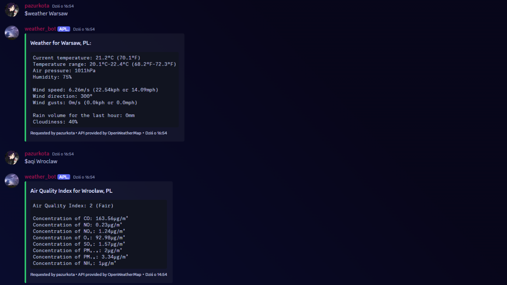

# Weather Bot
*Simple weather Discord bot created for [Codédex](https://www.codedex.io/home) final project!*




---

### Cloning repo:
To clone repository, you can use Git client like GitKraken or Tower, or just simply type:
```commandline
git clone https://github.com/pazurkota/weather_bot.git
```

---

### Running bot:
Prerequisites:
- [Discord Bot Token](https://discord.com/developers/applications) with all intents
- [OpenWeather API](https://openweathermap.org/api) key

To run this bot: 
1. Make sure you are running `Python 3.8` or newer
2. You need both `requests` and `discord` packages installed:
```commandline
python -m pip install requests
```
```commandline
python -m pip install -U discord.py
```
3. Create `data.json` file in root directory (where `program.py` is localized) with following data:
```json
{
  "token": "DISCORD BOT TOKEN",
  "api_key": "API KEY FROM https://openweathermap.org/"
}
```
4. Open project with PyCharm or any other IDE
5. Run the project

---

### Commands:
The bot prefix is `$`
- `$weather <city>` - Get current weather for specified city
- `$aqi <city>` - Get current air quality for specified city

If your location have more than one word, type name in quotes, e.g. `$weather "New York"`

---

### Project structure:

This bot is simple, but some files are in separate folders for better organization:
- `data` - contains all methods to get data neither from API or `data.json` file
- `parse` - contains all methods to parse data from API and return it as Discord Embed

---

### Appendix:
This was my first project with Python, so any feedback is appreciated! If you have any questions, feel free to ask me on Discord `@pazurkota`

Also, any suggestions for new features or contributions are welcome!